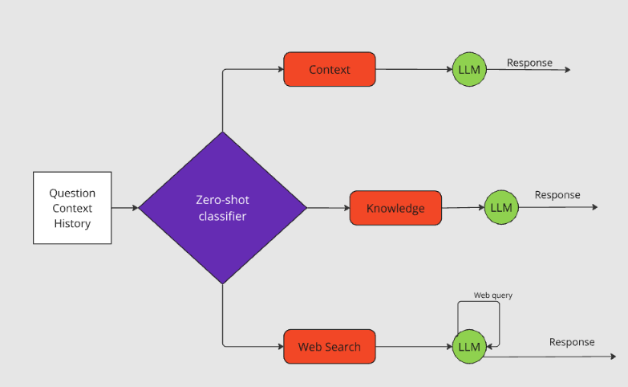
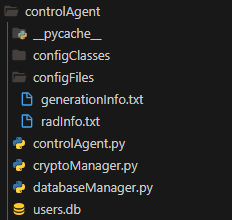

<table  border="0">
  <tr>
    <td></td>
    <td>
      <h1>MARS</h1>
      
<i>(Sistema RAG de Agentes Múltiples)</i>

    </td>
  </tr>
</table>

<h2>¿Qué es MARS?</h2>

MARS es una plataforma intuitiva diseñada para la creación rápida y sencilla de sistemas RAG utilizando tus propios archivos PDF. Ofrece un conjunto completo de herramientas para la interacción fluida con documentos, abarcando desde una interfaz de usuario hasta la gestión de bases de datos y generación de respuestas.

Además, MARS permite que cada usuario en el sistema tenga hasta tres bases de conocimiento diferentes de las cuales se puede recuperar contexto.

<h2>Arquitectura de MARS</h2>
<td></td>

<h3>Agente de Visualización</h3>

Es responsable de proporcionar una interfaz de usuario, gestionar el historial de conversación y acceder a la base de conocimiento seleccionada. En este caso, el agente está diseñado para un <b>usuario único</b>.

<h3>Agente de Control</h3>

Es responsable de la autenticación de usuarios, así como de controlar qué bases de datos poseen (hasta un máximo de 3). También gestiona la lógica del sistema, decidiendo qué agente llamar y determinando el formato de la información enviada a ellos para cumplir con las tareas solicitadas por el usuario. El agente está diseñado para un <b>multiusuario</b>.

<h3>Agente de Recuperación y Base de Datos</h3>

Es responsable de crear bases de datos y monitorear su estado. Maneja la interacción directa con ellas, incluyendo la creación, eliminación y recuperación de contexto de las bases de datos. El agente está diseñado para un <b>multiusuario</b>.

 

 Chroma como base de datos vectorial

<h3>Agente de Generación</h3>

Es responsable de interactuar con el modelo de lenguaje para generar respuestas. Clasifica el texto de entrada en tres clases diferentes y genera una respuesta basada en la clase. Dentro de este agente, se combinan dos tipos de agentes: agentes convencionales de sistemas multiagente y agentes de lenguaje de LangChain. Este sistema integra tanto el sistema de generación de texto que utiliza LangChain como el sistema de recuperación de información web. El agente está diseñado para un <b>multiusuario</b>.

<td></td>

<h2>¿Cómo usar MARS?</h2>
<ol>
  <li>Configura tu entorno virtual en Python 3.10 e instala las bibliotecas requeridas que se enumeran en el archivo requirements.txt.  
   </li>
    
<pre><code>
    pip install -r requirements.txt</code></pre>

  
  <li>Configura el puerto y la interfaz de red para cada agente.</li>
  
Flask se utiliza como servidor, por lo que modificar la línea donde se configuran estos parámetros será suficiente.

  
<pre><code>
    def run(self):
        self.app.run(port=5005, debug=False)</code></pre>

  
  <li>Configura cada agente para habilitar la comunicación con los otros agentes.</li>
  
Para hacer esto, debes completar los campos de los archivos de información con los datos apropiados. Estos archivos están ubicados en la carpeta <i>configFiles</i>, uno en el <i>Agente de Visualización</i> y otro en el <i>Agente de Control</i>. Solo se debe cambiar la información requerida; no alteres los nombres de los campos. Estos archivos se utilizan para poblar las clases de configuración.

<td></td>
  
  <li>Proporciona las claves necesarias.</li>
  
En el <i>Agente de Generación</i>, crea archivos llamados <i>configFiles/openAIAPI.txt</i> y <i>configFiles/tavilyAPI.txt</i>, que deben contener la clave API de OpenAI necesaria para usar el LLM y la clave API de Tavily necesaria para usar la búsqueda en la web, respectivamente.

</ol>

<em>Nota</em>

Para que un usuario interactúe con el Agente de Control, debe tener su nombre de usuario y contraseña almacenados en la base de datos. Actualmente, solo se ha ingresado el usuario de ejemplo proporcionado. Si deseas modificar, agregar un usuario diferente o crear un sistema automatizado para agregar usuarios, esto debe hacerse en la función insert_users del archivo <i>controlAgent/databaseManager.py</i>.

La implementación actual se ve así:

<pre><code>def insert_users(self):
    user_id = self.add_user('al', 'veryDifficultPass')
    if user_id:
        self.add_databases(user_id)</code></pre>

<h2>¿Cómo funciona la encriptación en MARS?</h2>

Debido al uso del protocolo HTTP en lugar de HTTPS, todos los mensajes que contienen contenido sensible se envían cifrados manualmente en un mensaje con el siguiente formato:

<i>{'cipherData': CipherJson}</i>

Todos los mensajes utilizan la misma función que se encuentra en el archivo <i>cryptoManager.py</i>, pero con diferentes claves. Cada vez que se envía un mensaje a un agente, se cifra con la clave del destinatario, y cuando se espera una respuesta, se descifra usando la misma clave que se utilizó para el cifrado.

<h2>Demo</h2>

 

El archivo de prueba contiene notas sobre cómo funciona Linux.

<h2>Problemas conocidos</h2>
<ul>
  <li>Cuando se crea una nueva base de datos en un espacio ya utilizado, el proceso interno funciona correctamente, pero el historial de mensajes anterior no se borra, y se recomienda refrescar la página.
 
</li>
  <li>Hay algunos problemas al eliminar bases de datos y contenido en el Agente RAG. Esto se debe a procesos en segundo plano que no completan la ejecución al crear embeddings o acceder a la base de datos. Por lo tanto, aunque el sistema actualiza sus tablas correctamente, las bases de datos vectoriales y los archivos temporales deben eliminarse manualmente por ahora.
 
</li>
</ul>

<h2>Próximos pasos</h2>

Crea una mejor manera de recibir datos a través de JSON definiendo esquemas para la estructura de datos requerida utilizando Pydantic y gestiona todos los datos relacionados encapsulados dentro de una clase en lugar de usar variables individuales.

Mejora el manejo de errores y la trazabilidad utilizando bitacoras.

Integra un detector de alucinaciones.

