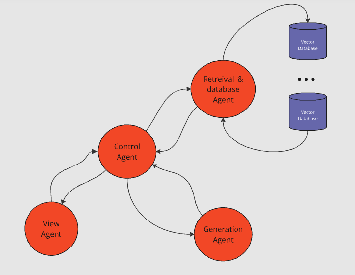

<table  border="0">
  <tr>
    <td></td>
    <td>
      <h1>MARS</h1>
      
<i>(Multi-Agent RAG System)</i>

    </td>
  </tr>
</table>

<h2>What is MARS? </h2>

MARS is an intuitive platform designed for the rapid and effortless creation of RAG systems using your own PDF files. It offers a comprehensive suite of tools for seamless document interaction, encompassing everything from an  user interface to  database management and response generation.

<h2>MARS architecture</h2>
<td></td>

<h3>View Agent</h3>

It is responsible for providing a user interface, managing the conversation history, and accessing the selected knowledge base. In this case, the agent is designed for a <b> single user</b>.

<h3>Control Agent</h3>

It is responsible for user authentication as well as controlling which databases they own (up to a maximum of 3). It also manages the system's logic, deciding which agent to call and determining the format of the information sent to them in order to fulfill the tasks requested by the user. The agent is designed for a <b> multi user</b>.

<h3>Retrieval and Database Agent</h3>

It is responsible for creating databases as well as monitoring their status. It handles direct interaction with them, including creating, deleting, and retrieving context from the databases. The agent is designed for a <b> multi user</b>.

<h3>Generation Agent</h3>
  
